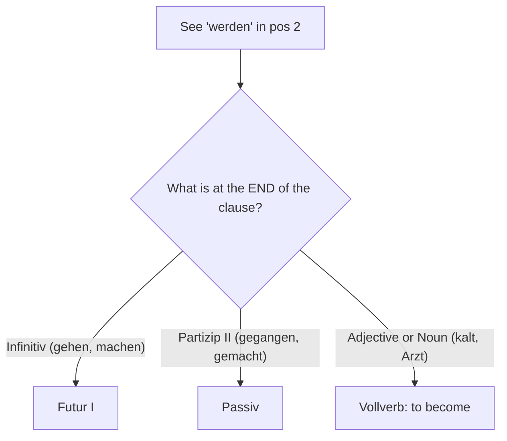

# Module 10: Futur I & Die drei Funktionen von "werden"

> **CEFR Goal:** Can use Futur I for predictions, promises, and assumptions. Can distinguish between the three distinct grammatical functions of the verb *werden* (becoming, future, passive).
>
> **Scope:** 📘 Book Core: Futur I (Kap. 59) + Die drei Funktionen von "werden" (Kap. 60). 📚 Expert Addition: The "End of Sentence" Diagnostic Flowchart.
>
> 🇻🇳 *Module này khép lại chuyên đề về cụm động từ nâng cao. Bạn sẽ học thì Tương lai (Futur I) và sau đó tổng hợp lại toàn bộ "vũ trụ" của động từ `werden` — từ khóa quan trọng nhất trong tiếng Đức B1.*

---

## Part 1: Futur I (Kapitel 59)

### 1.1 Do we really need a Future Tense?

In daily spoken German, you usually talk about the future using the **Present Tense (Präsens) + a time word** (morgen, nächste Woche).
* *Ich **fliege morgen** nach Berlin.* (I am flying to Berlin tomorrow.)

So when do we use Futur I? 
1. **Predictions / Weather forecasts (Prognosen):** *Morgen **wird** es **regnen**.* (It will rain tomorrow.)
2. **Promises (Versprechen):** *Ich **werde** dich nie **vergessen**!* (I will never forget you!)
3. **Assumptions about the Present (Vermutungen):** *Wo ist Thomas? - Er **wird wohl** zu Hause **sein**.* (Where is Thomas? - He's probably at home.)

### 1.2 Structure of Futur I
**werden (conjugated) + Infinitiv (at the end)**

| Position 1 | Position 2 (werden) | Mittelfeld | Ende (Infinitiv) |
|---|---|---|---|
| In 50 Jahren | **werden** | die Menschen auf dem Mars | **leben**. |
| Ich | **werde** | dir bei den Hausaufgaben | **helfen**. |
| Er | **wird** | wohl (probably) im Büro | **sein**. |

---

## Part 2: Die drei Funktionen von "werden" (Kapitel 60)

The verb `werden` is a shapeshifter. It has **three completely different jobs** in German grammar. You must know how to tell them apart!

### Function 1: Vollverb (Main Verb) = "to become"
* **Structure:** werden + Noun / Adjective
* **Meaning:** Describes a change of state or a profession.
* **Example:** *Es **wird** dunkel.* (It is getting/becoming dark.) 
* **Example:** *Er **wird** Arzt.* (He is becoming a doctor.)
* **Perfekt:** ist ... **geworden** (*Er ist Arzt **geworden**.*)

### Function 2: Hilfsverb für Futur I (Helping Verb for Future) = "will"
* **Structure:** werden + Infinitiv
* **Meaning:** Future events, predictions, or assumptions.
* **Example:** *Er **wird** Arzt **studieren**.* (He will study to be a doctor.)
* **Perfekt:** (Not used in spoken German. Use Futur II for the past future, which is C1 level.)

### Function 3: Hilfsverb für Passiv (Helping Verb for Passive) = "is/are being"
* **Structure:** werden + Partizip II
* **Meaning:** The passive voice (focus on the action, not the doer).
* **Example:** *Der Arzt **wird** (vom Patienten) **gesucht**.* (The doctor is being searched for.)
* **Perfekt:** ist ... Partizip II + **worden** (*Der Arzt ist gesucht **worden**.*)

---

## 3 · 📚 Expert Addition: The "werden" Diagnostic Flowchart

When you read a sentence with `werden`, how do you know which of the 3 functions it is?
**Look at the END of the sentence!**

**Let's test the flowchart:**
1. *Das Haus **wird** morgen **gebaut**.* -> Ends with Partizip II (gebaut) -> **Passiv** (The house is being built tomorrow.)
2. *Er **wird** morgen ein Haus **bauen**.* -> Ends with Infinitiv (bauen) -> **Futur I** (He will build a house tomorrow.)
3. *Das Haus **wird** sehr **schön**.* -> Ends with Adjective (schön) -> **Vollverb** (The house is becoming/getting very beautiful.)

---

## 4 · Common Mistakes (Häufige Fehler)

| # | ❌ Wrong | ✅ Correct | Why |
|---|---|---|---|
| 1 | Er wird gehen zu Hause. | Er **wird** nach Hause **gehen**. | In Futur I, the Infinitive must be at the very end of the sentence. |
| 2 | Ich will Arzt. | Ich **werde** Arzt. | False friend! "wollen" = to want. "werden" = to become/will. |
| 3 | Ich werde studiert morgen. | Ich **werde** morgen **studieren**. | Future requires the Infinitive (*studieren*), not the Partizip II (*studiert*). |
| 4 | Das Auto wird reparieren. | Das Auto **wird repariert**. | Passive requires the Partizip II (*repariert*). |

---

## Next Steps

→ [Exercises](exercises.md) · [Answers](answers.md) · [Vocabulary](vocabulary.md) · [Flashcards](flashcards.md) · [Exam Tips](exam-tips.md)
